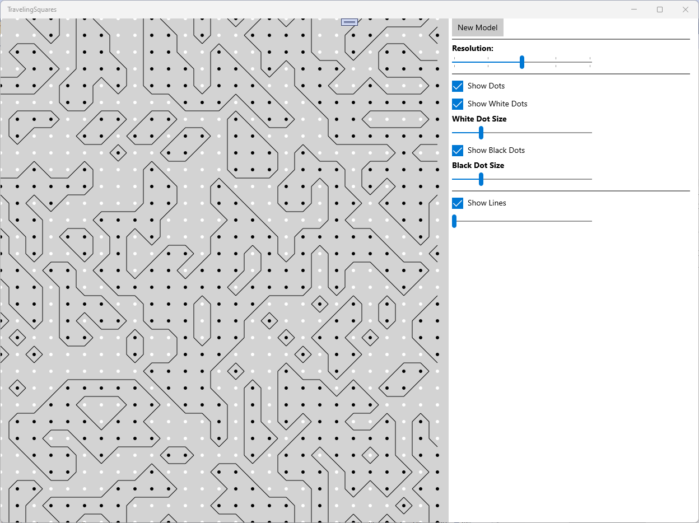

# Traveling Squares (UWP Application)

## **Overview**
The **Traveling Squares** UWP application is a graphical program that visualizes a grid-based system of dots and lines, inspired by **Marching Squares** or similar computational geometry techniques.

## **What the application does**
1. **Displays a grid of dots**:
   - The grid is dynamically generated based on a `resolution` value.
   - Each cell in the grid can contain either a **black dot** or a **white dot**.
   - The dot size can be adjusted dynamically.

2. **Draws connecting lines between the dots**:
   - The program determines which lines to draw based on the values in a 2D array (`Array2D`).
   - Each cell in the grid has four corners, and a state is computed based on the presence of dots at those corners.
   - The `GetState()` function calculates the pattern of connections between dots.
   - A lookup table (implemented via a switch-case) determines which lines to draw based on the computed state.

3. **Allows user interaction via UI controls**:
   - A **resolution slider** allows adjusting the density of the grid.
   - A **dot size slider** lets the user change the size of the dots.
   - A **line thickness slider** adjusts the thickness of the connecting lines.
   - Toggle commands (implemented via `RelayCommand`) allow the user to show/hide white dots, black dots, or lines.

4. **Dynamic updates**:
   - When the resolution or dot size changes, the UI is updated by redrawing the dots and lines.
   - The program clears the canvas (`DrawingCanvas`) before redrawing.
   - The `Init()` function initializes the grid, optionally regenerating it with random values.

## **How it works technically**
- The **ViewModel** (`ViewModel.cs`):
  - Implements **INotifyPropertyChanged** for UI binding.
  - Contains all the logic for drawing and handling user interactions.
  - Generates the 2D grid of dots (`Array2D`) with random values.
  - Provides **commands** (`RelayCommand.cs`) for user interactions.

- **MainPage.xaml.cs**:
  - Handles event-driven interactions from the UI.
  - Creates an instance of `ViewModel` and assigns it to the `DataContext`.
  - Calls `vm.Draw()` whenever a UI control is manipulated.

## **Possible Use Cases**
- **Visualization of cellular automata**.
- **Marching Squares algorithm** for contour generation.
- **Generative art** where patterns emerge based on dot placement.
- **Grid-based interactive UI experiments**.
"""
